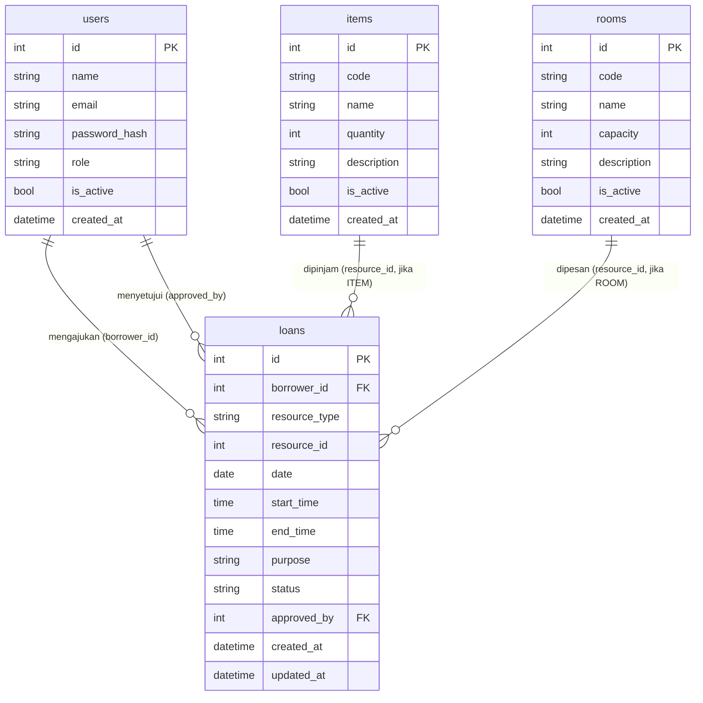

# Dokumentasi Database — SiPinjam Kampus

> **Database Engine:** SQLite (development) · Turso / LibSQL (production)  
> **ORM:** SQLModel 0.0.22 (berbasis SQLAlchemy 2.x + Pydantic v2)  
> **Migrasi:** Alembic 1.14  

---

## Daftar Isi

1. [Ringkasan Skema](#1-ringkasan-skema)
2. [Entity Relationship Diagram (ERD)](#2-entity-relationship-diagram-erd)
3. [Tabel: `users`](#3-tabel-users)
4. [Tabel: `items`](#4-tabel-items)
5. [Tabel: `rooms`](#5-tabel-rooms)
6. [Tabel: `loans`](#6-tabel-loans)
7. [Enum & Nilai Tetap](#7-enum--nilai-tetap)
8. [Relasi Antar Tabel](#8-relasi-antar-tabel)
9. [Indeks](#9-indeks)
10. [Logika Bisnis Berbasis Database](#10-logika-bisnis-berbasis-database)
11. [Migrasi dengan Alembic](#11-migrasi-dengan-alembic)
12. [Konfigurasi Koneksi](#12-konfigurasi-koneksi)
13. [Contoh Query Penting](#13-contoh-query-penting)

---

## 1. Ringkasan Skema

```
┌──────────┐        ┌──────────┐        ┌──────────┐
│  users   │        │  items   │        │  rooms   │
│──────────│        │──────────│        │──────────│
│ id  (PK) │        │ id  (PK) │        │ id  (PK) │
│ name     │        │ code     │        │ code     │
│ email    │        │ name     │        │ name     │
│ password │        │ quantity │        │ capacity │
│ role     │        │ descript.│        │ descript.│
│ is_active│        │ is_active│        │ is_active│
│ created  │        │ created  │        │ created  │
└────┬─────┘        └──────────┘        └──────────┘
     │ 1                                     
     │                                       
     │ N (borrower_id)                       
     ▼                                       
┌──────────────────────────────────┐         
│              loans               │         
│──────────────────────────────────│         
│ id          (PK)                 │         
│ borrower_id (FK → users.id)      │         
│ resource_type  ITEM | ROOM       │  ──►  items.id  atau  rooms.id
│ resource_id    (soft ref)        │         
│ date                             │         
│ start_time                       │         
│ end_time                         │         
│ purpose                          │         
│ status      PENDING/APPROVED/... │         
│ approved_by (FK → users.id)      │         
│ created_at                       │         
│ updated_at                       │         
└──────────────────────────────────┘         
```

> **Catatan:** Kolom `resource_id` pada tabel `loans` adalah *soft foreign key* — nilai ini merujuk ke `items.id` **atau** `rooms.id` tergantung nilai `resource_type`. Tidak ada database-level foreign key constraint agar tabel tetap generik/polimorfis.

---

## 2. Entity Relationship Diagram (ERD)



---

## 3. Tabel: `users`

Menyimpan seluruh pengguna sistem, baik Admin maupun Peminjam.

**DDL (SQL):**

```sql
CREATE TABLE users (
    id            INTEGER     PRIMARY KEY AUTOINCREMENT,
    name          VARCHAR(200) NOT NULL,
    email         VARCHAR(200) NOT NULL UNIQUE,
    password_hash VARCHAR(512) NOT NULL,
    role          VARCHAR(20)  NOT NULL DEFAULT 'BORROWER',
    is_active     BOOLEAN      NOT NULL DEFAULT TRUE,
    created_at    DATETIME     NOT NULL
);

CREATE INDEX ix_users_name  ON users (name);
CREATE UNIQUE INDEX ix_users_email ON users (email);
```

**Penjelasan Kolom:**

| Kolom | Tipe | Null | Default | Keterangan |
|-------|------|------|---------|------------|
| `id` | INTEGER | NO | auto | Primary key, auto-increment |
| `name` | VARCHAR(200) | NO | — | Nama lengkap pengguna |
| `email` | VARCHAR(200) | NO | — | Email unik, digunakan untuk login |
| `password_hash` | VARCHAR(512) | NO | — | Bcrypt hash dari password pengguna |
| `role` | VARCHAR(20) | NO | `BORROWER` | Nilai: `ADMIN` atau `BORROWER` |
| `is_active` | BOOLEAN | NO | `TRUE` | Flag soft-disable akun |
| `created_at` | DATETIME | NO | UTC now | Waktu registrasi (UTC) |

**Aturan:**

- `email` harus unik di seluruh sistem.
- `password_hash` tidak pernah menyimpan plain-text password. Proses hashing menggunakan bcrypt dengan cost factor default.
- `is_active = FALSE` menonaktifkan akun tanpa menghapus data historis.

---

## 4. Tabel: `items`

Menyimpan daftar peralatan laboratorium yang dapat dipinjam.

**DDL (SQL):**

```sql
CREATE TABLE items (
    id          INTEGER       PRIMARY KEY AUTOINCREMENT,
    code        VARCHAR(50)   NOT NULL UNIQUE,
    name        VARCHAR(200)  NOT NULL,
    quantity    INTEGER       NOT NULL DEFAULT 1,
    description VARCHAR(1000) NULL,
    is_active   BOOLEAN       NOT NULL DEFAULT TRUE,
    created_at  DATETIME      NOT NULL
);

CREATE UNIQUE INDEX ix_items_code ON items (code);
CREATE INDEX        ix_items_name ON items (name);
```

**Penjelasan Kolom:**

| Kolom | Tipe | Null | Default | Keterangan |
|-------|------|------|---------|------------|
| `id` | INTEGER | NO | auto | Primary key |
| `code` | VARCHAR(50) | NO | — | Kode unik peralatan, misal: `IT001`, `PRY-A` |
| `name` | VARCHAR(200) | NO | — | Nama deskriptif peralatan |
| `quantity` | INTEGER | NO | `1` | Jumlah total unit yang tersedia (≥ 0) |
| `description` | VARCHAR(1000) | YES | NULL | Deskripsi tambahan, opsional |
| `is_active` | BOOLEAN | NO | `TRUE` | Soft-delete flag |
| `created_at` | DATETIME | NO | UTC now | Waktu item ditambahkan |

**Aturan:**

- `code` harus unik. Duplikasi akan menghasilkan `400 Bad Request` dari `ItemService`.
- `quantity = 0` berarti item masih terdaftar namun tidak tersedia untuk dipinjam.
- Penghapusan dilakukan secara *soft delete* (`is_active = FALSE`); data historis peminjaman tetap terjaga.

---

## 5. Tabel: `rooms`

Menyimpan daftar ruangan kampus yang dapat dipesan.

**DDL (SQL):**

```sql
CREATE TABLE rooms (
    id          INTEGER       PRIMARY KEY AUTOINCREMENT,
    code        VARCHAR(50)   NOT NULL UNIQUE,
    name        VARCHAR(200)  NOT NULL,
    capacity    INTEGER       NOT NULL DEFAULT 1,
    description VARCHAR(1000) NULL,
    is_active   BOOLEAN       NOT NULL DEFAULT TRUE,
    created_at  DATETIME      NOT NULL
);

CREATE UNIQUE INDEX ix_rooms_code ON rooms (code);
CREATE INDEX        ix_rooms_name ON rooms (name);
```

**Penjelasan Kolom:**

| Kolom | Tipe | Null | Default | Keterangan |
|-------|------|------|---------|------------|
| `id` | INTEGER | NO | auto | Primary key |
| `code` | VARCHAR(50) | NO | — | Kode unik ruangan, misal: `R101`, `LAB-A` |
| `name` | VARCHAR(200) | NO | — | Nama ruangan |
| `capacity` | INTEGER | NO | `1` | Kapasitas maksimal pengguna (≥ 1) |
| `description` | VARCHAR(1000) | YES | NULL | Fasilitas atau deskripsi tambahan |
| `is_active` | BOOLEAN | NO | `TRUE` | Soft-delete flag |
| `created_at` | DATETIME | NO | UTC now | Waktu ruangan ditambahkan |

**Aturan:**

- `code` harus unik. Duplikasi ditolak oleh `RoomService`.
- Penghapusan dilakukan secara *soft delete*.
- Konflik jadwal ruangan dicek oleh `BorrowingService.detect_conflict()`, **bukan** di level database constraint.

---

## 6. Tabel: `loans`

Menyimpan seluruh permintaan peminjaman — baik peralatan maupun ruangan. Ini adalah tabel inti domain sistem.

**DDL (SQL):**

```sql
CREATE TABLE loans (
    id            INTEGER      PRIMARY KEY AUTOINCREMENT,
    borrower_id   INTEGER      NOT NULL REFERENCES users(id),
    resource_type VARCHAR(10)  NOT NULL,
    resource_id   INTEGER      NOT NULL,
    date          DATE         NOT NULL,
    start_time    TIME         NOT NULL,
    end_time      TIME         NOT NULL,
    purpose       VARCHAR(500) NOT NULL,
    status        VARCHAR(20)  NOT NULL DEFAULT 'PENDING',
    approved_by   INTEGER      NULL REFERENCES users(id),
    created_at    DATETIME     NOT NULL,
    updated_at    DATETIME     NULL
);

CREATE INDEX ix_loans_borrower_id  ON loans (borrower_id);
CREATE INDEX ix_loans_resource_id  ON loans (resource_id);
```

**Penjelasan Kolom:**

| Kolom | Tipe | Null | Default | Keterangan |
|-------|------|------|---------|------------|
| `id` | INTEGER | NO | auto | Primary key |
| `borrower_id` | INTEGER | NO | — | FK → `users.id` — pengguna yang mengajukan |
| `resource_type` | VARCHAR(10) | NO | — | Nilai: `ITEM` atau `ROOM` |
| `resource_id` | INTEGER | NO | — | ID referensi ke `items.id` atau `rooms.id` |
| `date` | DATE | NO | — | Tanggal peminjaman (format: `YYYY-MM-DD`) |
| `start_time` | TIME | NO | — | Waktu mulai penggunaan (format: `HH:MM:SS`) |
| `end_time` | TIME | NO | — | Waktu selesai penggunaan (format: `HH:MM:SS`) |
| `purpose` | VARCHAR(500) | NO | — | Tujuan peminjaman yang dinyatakan peminjam |
| `status` | VARCHAR(20) | NO | `PENDING` | Lihat siklus status di bawah |
| `approved_by` | INTEGER | YES | NULL | FK → `users.id` — admin yang memproses |
| `created_at` | DATETIME | NO | UTC now | Waktu pengajuan |
| `updated_at` | DATETIME | YES | NULL | Waktu terakhir status diperbarui |

**Siklus Status (`status`):**

```
  [Peminjam mengajukan]
         │
         ▼
      PENDING
      /      \
   (Admin)  (Admin)
     │          │
     ▼          ▼
  APPROVED   REJECTED  ← (terminal)
     │
   (Admin)
     │
     ▼
  COMPLETED            ← (terminal)
```

| Dari | Ke | Siapa | Keterangan |
|------|----|-------|------------|
| *(baru)* | `PENDING` | Peminjam | Saat loan pertama dibuat |
| `PENDING` | `APPROVED` | Admin | Ketersediaan dicek ulang saat ini |
| `PENDING` | `REJECTED` | Admin | Permintaan ditolak |
| `APPROVED` | `COMPLETED` | Admin | Item/ruangan telah dikembalikan |

**Catatan desain `resource_type` + `resource_id` (Polimorfik):**

Kolom ini menggunakan pola *Generic Foreign Key* (tanpa FK constraint database). Keuntungannya: satu tabel `loans` dapat menangani dua jenis sumber daya tanpa join table tambahan. Integritas referensial dijaga di layer service.

---

## 7. Enum & Nilai Tetap

Semua enum disimpan sebagai `VARCHAR` di database (bukan tipe ENUM native).

### `UserRole`

| Nilai DB | Arti |
|----------|------|
| `ADMIN` | Administrator sistem — dapat CRUD item/ruangan, setujui/tolak/selesaikan loan |
| `BORROWER` | Peminjam — dapat ajukan loan dan melihat riwayat milik sendiri |

### `ResourceType`

| Nilai DB | Arti |
|----------|------|
| `ITEM` | `resource_id` merujuk ke `items.id` |
| `ROOM` | `resource_id` merujuk ke `rooms.id` |

### `LoanStatus`

| Nilai DB | Arti | State |
|----------|------|-------|
| `PENDING` | Menunggu persetujuan admin | Aktif |
| `APPROVED` | Disetujui — sedang dipinjam | Aktif |
| `REJECTED` | Ditolak oleh admin | Terminal |
| `COMPLETED` | Selesai — item/ruangan dikembalikan | Terminal |

> **"Aktif"** = dihitung dalam deteksi konflik. Status `PENDING` dan `APPROVED` sama-sama dianggap aktif untuk mencegah overbooking.

---

## 8. Relasi Antar Tabel

| Relasi | Tipe | Kolom |
|--------|------|-------|
| `loans.borrower_id` → `users.id` | Many-to-One | FK dengan index |
| `loans.approved_by` → `users.id` | Many-to-One | FK nullable |
| `loans.resource_id` → `items.id` | Many-to-One (soft) | Hanya jika `resource_type = 'ITEM'` |
| `loans.resource_id` → `rooms.id` | Many-to-One (soft) | Hanya jika `resource_type = 'ROOM'` |

**Tidak ada tabel pivot / junction table** karena hubungan antar entitas linear dan tanpa relasi many-to-many.

---

## 9. Indeks

| Tabel | Kolom | Tipe Indeks | Alasan |
|-------|-------|-------------|--------|
| `users` | `email` | UNIQUE | Login lookup, uniqueness check |
| `users` | `name` | INDEX | Filter/pencarian nama |
| `items` | `code` | UNIQUE | Kode unik, lookup cepat |
| `items` | `name` | INDEX | Filter/pencarian nama |
| `rooms` | `code` | UNIQUE | Kode unik, lookup cepat |
| `rooms` | `name` | INDEX | Filter/pencarian nama |
| `loans` | `borrower_id` | INDEX | Filter peminjaman per user |
| `loans` | `resource_id` | INDEX | Filter peminjaman per sumber daya |

> **Query conflict detection** memanfaatkan indeks `resource_id` dan filter pada `resource_type`, `date`, `start_time`, `end_time`, dan `status` — semua tanpa full table scan pada dataset normal.

---

## 10. Logika Bisnis Berbasis Database

### 10.1 Deteksi Konflik Jadwal

Diimplementasikan di [`LoanRepository.get_conflicting_loans()`](../app/repositories/loan_repository.py).

**Kondisi overlap:**

```
A.start_time < B.end_time  AND  A.end_time > B.start_time
```

Dimana `A` = loan yang sudah ada, `B` = loan baru yang diajukan.

**Query SQL yang dihasilkan:**

```sql
SELECT * FROM loans
WHERE resource_type = :resource_type
  AND resource_id   = :resource_id
  AND date          = :loan_date
  AND status        IN ('PENDING', 'APPROVED')
  AND start_time    < :end_time
  AND end_time      > :start_time
  AND id           != :exclude_loan_id;  -- digunakan saat re-check approve
```

### 10.2 Validasi Kuantitas Item

Untuk `resource_type = 'ITEM'`, sistem menghitung jumlah loan `APPROVED` yang tumpang tindih:

```sql
-- Count approved loans untuk item yang sama pada jendela waktu yang sama
SELECT COUNT(*) FROM loans
WHERE resource_type = 'ITEM'
  AND resource_id   = :item_id
  AND date          = :loan_date
  AND status        = 'APPROVED'
  AND start_time    < :end_time
  AND end_time      > :start_time;
```

Jika hasilnya `>= item.quantity`, permintaan baru ditolak dengan `409 Conflict`.

### 10.3 Pencegahan Double-Booking Ruangan

Untuk `resource_type = 'ROOM'`, cukup satu loan `APPROVED` yang overlap sudah memblokir permintaan baru — karena ruangan hanya bisa digunakan oleh satu pihak dalam satu waktu.

### 10.4 Re-Check saat Approve

Saat admin menyetujui loan, `BorrowingService.approve_loan()` memanggil ulang `detect_conflict()` dengan `exclude_loan_id=loan.id` untuk mencegah race condition dari dua admin yang menyetujui loan berbeda untuk slot yang sama secara bersamaan.

---

## 11. Migrasi dengan Alembic

**Struktur file:**

```text
apps/backend/
├── alembic.ini
└── migrations/
    ├── env.py
    └── versions/
        └── 001_initial.py   ← Skema awal (semua tabel)
```

**Perintah dasar:**

```bash
cd apps/backend
venv\Scripts\activate   # Windows

# Terapkan semua migrasi pending
alembic upgrade head

# Buat migrasi baru setelah mengubah model
alembic revision --autogenerate -m "nama_perubahan"

# Rollback satu langkah
alembic downgrade -1

# Lihat riwayat migrasi
alembic history

# Cek versi database saat ini
alembic current
```

**Catatan:** Di environment `development`, tabel dibuat otomatis oleh `init_db()` pada startup FastAPI menggunakan `SQLModel.metadata.create_all()`. Alembic lebih direkomendasikan untuk environment `production`.

---

## 12. Konfigurasi Koneksi

Koneksi database dikontrol via environment variable `DATABASE_URL` di file `.env`.

### Development (SQLite)

```env
DATABASE_URL=sqlite:///./sipinjam.db
```

File `sipinjam.db` akan dibuat di direktori `apps/backend/` secara otomatis.

```python
# apps/backend/app/db/session.py
engine = create_engine(
    DATABASE_URL,
    connect_args={"check_same_thread": False},  # hanya untuk SQLite
    echo=True,  # aktifkan di development untuk melihat SQL log
)
```

### Production (Turso / LibSQL)

```env
DATABASE_URL=libsql://nama-database.turso.io?authToken=TOKEN_ANDA
```

LibSQL adalah fork SQLite yang kompatibel penuh, digunakan via `libsql-client` Python package.

### Testing (In-Memory SQLite)

Test menggunakan database in-memory yang di-reset setiap test case:

```python
# apps/backend/tests/conftest.py
engine = create_engine(
    "sqlite://",               # database in-memory
    connect_args={"check_same_thread": False},
    poolclass=StaticPool,      # satu koneksi untuk semua thread test
)
SQLModel.metadata.create_all(engine)
```

---

## 13. Contoh Query Penting

### Semua loan oleh peminjam tertentu

```sql
SELECT * FROM loans
WHERE borrower_id = 3
ORDER BY created_at DESC;
```

### Loan yang masih aktif (pending atau disetujui) hari ini

```sql
SELECT l.*, u.name as borrower_name
FROM loans l
JOIN users u ON l.borrower_id = u.id
WHERE l.date = DATE('now')
  AND l.status IN ('PENDING', 'APPROVED')
ORDER BY l.start_time;
```

### Semua peminjaman untuk item tertentu di jendela waktu tertentu

```sql
SELECT * FROM loans
WHERE resource_type = 'ITEM'
  AND resource_id   = 5
  AND date          = '2024-12-01'
  AND status        IN ('PENDING', 'APPROVED')
  AND start_time    < '14:00:00'
  AND end_time      > '09:00:00';
```

### Statistik ringkasan per status

```sql
SELECT status, COUNT(*) as jumlah
FROM loans
GROUP BY status
ORDER BY jumlah DESC;
```

### Peralatan yang paling sering dipinjam

```sql
SELECT i.code, i.name, COUNT(l.id) as total_pinjam
FROM items i
LEFT JOIN loans l ON l.resource_id = i.id AND l.resource_type = 'ITEM'
GROUP BY i.id, i.code, i.name
ORDER BY total_pinjam DESC
LIMIT 10;
```

### Ruangan dengan peminjaman terbanyak bulan ini

```sql
SELECT r.code, r.name, COUNT(l.id) as total_reservasi
FROM rooms r
LEFT JOIN loans l ON l.resource_id = r.id
               AND l.resource_type = 'ROOM'
               AND l.date >= DATE('now', 'start of month')
               AND l.status IN ('APPROVED', 'COMPLETED')
GROUP BY r.id, r.code, r.name
ORDER BY total_reservasi DESC;
```

---

*Dokumentasi ini dibuat berdasarkan source code model dan migrasi pada commit terakhir.*  
*File sumber: [`app/models/`](../apps/backend/app/models/) · [`migrations/versions/`](../apps/backend/migrations/versions/)*
